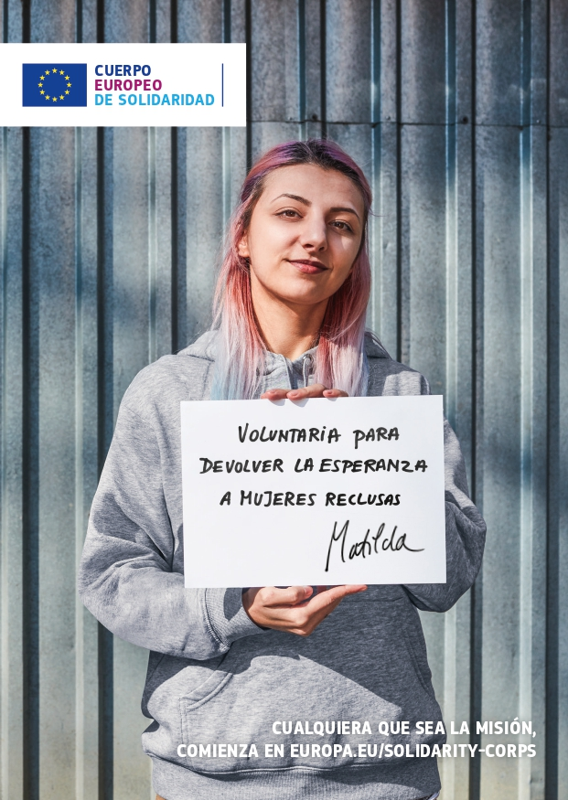
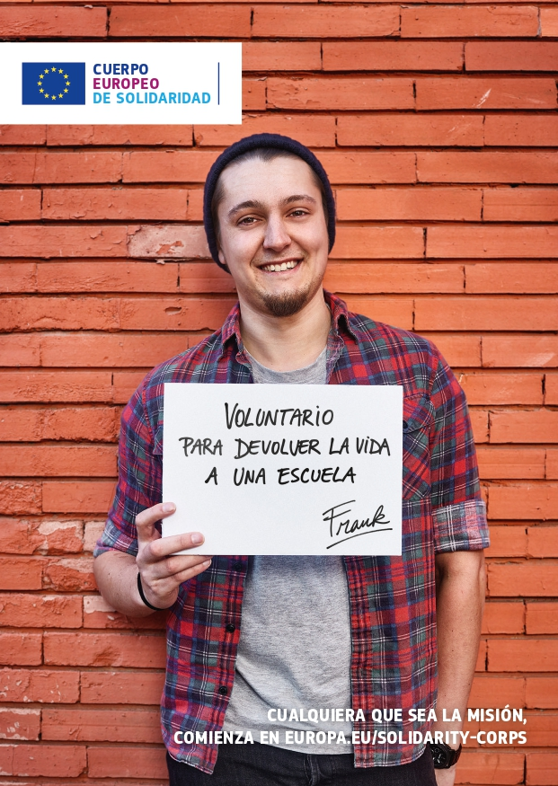

## ¿Qué es Erasmus+?

**Erasmus +** es el Programa de educación, formación, juventud y deporte de la
Comisión Europea para el período 2014-2020. Erasmus + ofrece más oportunidades
para la movilidad y la cooperación en los sectores de educación, formación y
juventud y es más fácil de acceder que sus predecesores. El programa está
abierto a estudiantes, aprendices, maestros, profesores, jóvenes, voluntarios,
trabajadores juveniles y personas que trabajan en el deporte. Para más
información sobre cómo participar o ser nuestro socio en alguno de nuestros
proyectos no dudes en contactarnos.

Más información sobre el programa Erasmus +:
http://www.erasmusplus.gob.es/index.html

Proyecto Erasmus + realizado por Omse e.V., IES Almeraya, La Guajira y La Periférica: Tastes of Diversity: Arts, Environment and Gastronomy. Intercambio juvenil con España, Alemania y Marruecos. Hecho en las ciudades de Agdz y Timidarte en el sur de Marruecos.

https://youtu.be/lkgdwwAUCdQ

Documental "Taste of diversity: Arts, Environment and Gastronomy" realizado por
la videoartista Inés Bermejo sobre la experiencia en Marruecos con el
Intercambio Juvenil del programa Eramus +

## ¿Qué es el CES?

**El Cuerpo Europeo de Solidaridad (CES)** es un programa de financiación de la Unión
Europea que crea oportunidades para que los jóvenes hagan voluntariado,
trabajen, se formen y gestionen sus propios proyectos solidarios en beneficio de
las comunidades de toda Europa.
El presidente de la Comisión Europea, Jean-Claude Juncker, anunció su creación
en su discurso anual sobre el Estado de la Unión, pronunciado en septiembre de
\2016. El Cuerpo Europeo de Solidaridad entró oficialmente en funcionamiento en
diciembre de 2016.
Tras un sencillo proceso de inscripción, los participantes podrán resultar
seleccionados para incorporarse a toda una serie de proyectos. Realizarán los
proyectos del Cuerpo Europeo de Solidaridad organizaciones debidamente
acreditadas y autorizadas para llevarlos a cabo.

El CES es una actividad educativa no formal que permite a los jóvenes de **entre
18 y 30 años** expresar su compromiso personal mediante un **servicio voluntario de
larga duración con los costes pagados**. Los proyectos pueden ser de interés
comunitario, en el ámbito social, ambiental o cultural. Pueden participar
personas entre **18 a 30 años**, que quieren dedicar su tiempo libre a causas
solidarias, con motivación por descubrir otras culturas y convivir estrechamente
con gente de otros países. Puedes solicitar los proyectos de Cuerpo Europeo de
Solidaridad siempre que tengas **30 años en el momento del comienzo del proyecto**.

Se trata de un **servicio voluntario con los costes pagados**. Es a tiempo completo,
durante un mínimo de 2 y un máximo de 12 meses dependiendo del proyecto, y
siempre en un país diferente del propio, ya sea dentro de la Unión Europea o
fuera de ella. Los proyectos de Cuerpo Europeo de Solidaridad se desarrollan
**durante todo el año**. Se puede pedir la participación en un proyecto de larga
duración (ej: 10 meses) aunque ya hayas realizado uno de corta duración (en este
caso de 2 meses, para llegar al límite de los 12 meses). No se puede hacer al
revés. Los/as voluntarios/as mejoran o adquieren competencias para su desarrollo
personal, educativo y profesional. Sus becas se conceden por la Comisión Europea
con el fin de que jóvenes europeos desarrollen una actividad de voluntariado. El
CES se desarrolla a través de actividades organizadas en colaboración entre
organizaciones legalmente establecidas, que envían o acogen voluntarios/as.

**El programa CES incluye:**

- El coste del transporte de ida y vuelta desde y hacia el país de origen
- Los gastos de alojamiento y alimentación durante el período del proyecto
- Un importe de dinero de bolsillo (varía según el coste de vida del país de
  acogida)
- Un seguro médico durante los meses de voluntariado
- Formación lingüística online en el idioma del país de acogida
- Tutoría personalizada con una persona responsable en el proyecto de acogida

**Forman parte del proyecto:**

**Persona voluntaria**. Persona voluntaria entre los 18 y los 30 años que quiera
participar en un proyecto de voluntariado de larga duración con los gastos
pagados.

**Organización de Acogida**. Se trata de una organización en un país europeo que
cuenta con un proyecto de interés social, cultural o medioambiental donde
cuenta con voluntarios europeos para su desarrollo.

**Organización de Apoyo**. Se trata de una organización del país de la persona
voluntaria que acompaña al voluntario en todo el proceso: formación,
seguimiento y evaluación. La Periférica es una organización acreditada para el
apoyo de voluntarios europeos, contacta con nosotras y te facilitaremos el
proceso de envío a tu proyecto favorito.

CES cuenta con tres convocatorias oficiales en febrero, abril, y octubre pero
puedes conseguir un proyecto a lo largo de todo el año. Podrás encontrar
proyectos en todos los países de la Unión Europea. En el siguiente enlace
puedes encontrar todos los proyectos que ahora mismo están buscando
voluntarios: http://europa.eu/youth/volunteering/project_es

El CES **no tiene costes para las personas voluntarias, es gratis**, si bien en
algunos casos tienen que comprar los billetes de avión ellas mismas que en
todos los casos le serán reembolsados por la organización de acogida. El
programa cubre el coste de los vuelos de ida y vuelta desde y hacia el país de
origen; los gastos de alojamiento y alimentación durante el período del
proyecto; un importe de dinero de bolsillo (varía según el coste de vida del
país de acogida).

**Cada proyecto cuenta con unas características distintas**. El alojamiento viene
especificado en la descripción de cada proyecto de voluntariado. **Varía mucho**:
Habitacion en casa compartida con otras personas voluntarias, habitación doble
compartida, casa independiente para la persona voluntaria...cada proyecto
cuenta con unas características propias, si bien todas ellas tienen que entrar
dentro de unos requisitos mínimos para que sea una vivienda digna.

**Cada proyecto cuenta con unas características distintas**. En algunos casos puede
que estés con más personas voluntarias europeos en la organización de acogida,
en otros casos puede que sean personas voluntarias locales o bien puede que
seas la única persona realizando el voluntariado europeo en el proyecto. En
todos los casos tendrás un tutor de la organización de acogida que te
acompañará y orientará durante todo el proceso. El CES es una gran oportunidad
para la integración con la comunidad local a través del voluntariado, por lo
que cada experiencia es única y cada formato irrepetible.

El CES cuenta con un **seguro específico para la persona voluntaria** durante todo
el proyecto en todo el mundo, que empieza el mismo día de la salida y acaba dos
meses después de la vuelta. Durante estos dos meses, el seguro sólo valdrá en
los dos países de envío y de acogida.

La lengua del proyecto viene **especificada en la descripción del proyecto** si
bien en muchos de los proyectos se pide como lengua el inglés. En algunos casos
concretos puede que se solicite un nivel específico del idioma local (como
puede ser el caso en voluntariado social con personas locales o bien
voluntariado en temas de comunicación, por ejemplo). En caso de que un proyecto
esté interesado en tu perfil, tendrá una entrevista por Skype para conoceros un
poquito mejor y ver tu nivel del idioma requerido. No obstante el CES ofrece
una formación lingüística online en el idioma del país de acogida.

**¿Cómo solicito un voluntariado CES?** Contacta con nostrxs y te lo contamos.

Más información sobre el programa Cuerpo Europeo de Solidaridad:
http://www.cuerpoeuropeodesolidaridad.injuve.es/es
